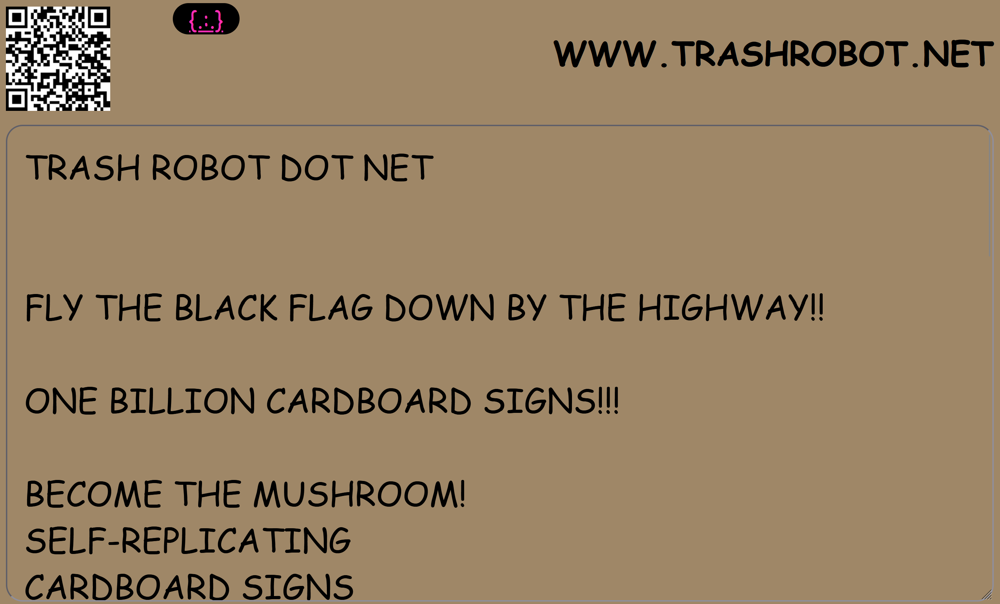

# [trashrobot-spore](https://github.com/lafelabs/trashrobot-spore/)

self-replicating web swarm

TRASH ROBOT DOT NET! 
FLY THE BLACK FLAG DOWN BY THE HIGHWAY!
ONE BILLION CARDBOARD SIGNS!
THE MEDIUM IS THE MESSAGE!
BECOME THE FUNGUS!

 - [https://trashrobot.net/](https://trashrobot.net/)
 - [http://localhost/trashrobot-spore/readme.html](http://localhost/trashrobot-spore/readme.html)
 - [index.html](index.html)
 - [editor.html](editor.html)
 - [load-file.php](load-file.php)
 - [save-file.php](save-file.php)
 - [list-files.php](list-files.php)
 - [list-directories.php](list-directories.php)
 - [qrcode.html](qrcode.html)
 - [README.md](README.md)
 - [readme.html](readme.html)
 - [spore.php](spore.php)
 - [meta-spore.php](meta-spore.php)
 - [spore.json](spore.json)
 - [wall.txt](wall.txt)
 - [https://www.digitalocean.com/](https://www.digitalocean.com/)
 - [https://www.apachefriends.org/](https://www.apachefriends.org/)
 - [https://ubuntu.com/desktop](https://ubuntu.com/desktop)
 - [php](https://www.php.net/)
 - [https://httpd.apache.org/](https://httpd.apache.org/)